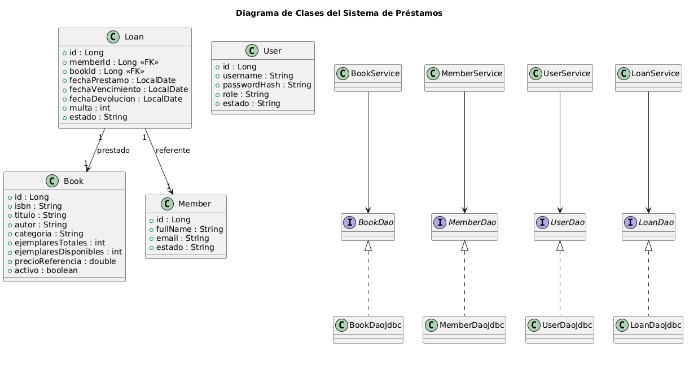

# LibroNova 📚 (Módulo Java 5.1)

Sistema de gestión de biblioteca por capas (DAO + Service + View) con JDBC, transacciones, validaciones, exportación CSV, logging a archivo y tests (JUnit 5).  
UI mediante `JOptionPane` para flujo rápido (Catálogo, Socios, Préstamos, Exportar).

## Tabla de contenidos

- [Arquitectura](#arquitectura)
- [Requisitos](#requisitos)
- [Instalación](#instalación)
- [Configuración](#configuración)
- [Ejecución](#ejecución)
- [Uso rápido](#uso-rápido)
- [Exportaciones](#exportaciones)
- [Logs](#logs)
- [Tests](#tests)
- [Decisiones de diseño](#decisiones-de-diseño)
- [Diagrama](#diagrama)

---

## Arquitectura

- **Capas**

  - `model/`: entidades (`Book`, `Member`, `User`, `Loan`)
  - `dao/` + `dao/jdbc/`: interfaces DAO e implementación JDBC (prepared statements, mapeo `ResultSet`)
  - `service/`: reglas de negocio, validaciones, transacciones en préstamos/devoluciones
  - `view/`: menús `JOptionPane` (Libros, Socios, Préstamos, Exportar)
  - `config/`: `DbManager` (conexión), `AppConfig` (properties/logging)
  - `util/`: `AppLogger` (logs + “simulación HTTP”), `CSVExporter`
  - `exception/`: excepciones personalizadas (ISBN duplicado, stock insuficiente, etc.)

- **Patrones**
  - DAO (acceso a datos), Service (lógica), Decorator en `UserService.create()` (setea `role=ASISTENTE`, `estado=ACTIVO` por defecto sin tocar el DAO).
  - Transacciones JDBC: `setAutoCommit(false)` → múltiples operaciones → `commit()` / `rollback()`.

## Requisitos

- Java 17+
- Maven 3.8+
- MySQL 8+
- NetBeans (opcional) o tu IDE favorito

## Instalación

1. Clonar el repo:
   ```bash
   git clone https://github.com/AnSan29/entregaPruebaDesempenio001
   cd entregaPruebaDesempenio001
   ```
2. Crear BD y tablas (ver `bd.sql`). Ejemplo:
   ```sql
   CREATE DATABASE IF NOT EXISTS libronova CHARACTER SET utf8mb4;
   USE libronova;
   -- Tablas: user, member, book, loan (índices incluidos)
   ```
3. Compilar:
   ```bash
   mvn clean package
   ```

## Configuración

Archivo: `src/main/resources/config.properties`

```properties
db.url=jdbc:mysql://localhost:3306/libronova
db.user=root
db.password=

diasPrestamo=7
multaPorDia=1500
export.dir=export
```

Logging: `src/main/resources/log.properties`  
Salida por consola + archivo `app.log` en la raíz.

## Ejecución

- Desde IDE: ejecutar `com.mycompany.libronova.LibroNova`.
- Con jar:
  ```bash
  java -jar target/libronova-1.0.0.jar
  ```

## Uso rápido

- **Libros**: crear, editar, listar, eliminar; validación ISBN único.
- **Socios**: crear, editar, activar/inactivar; filtros por nombre.
- **Préstamos**: presta (valida socio ACTIVO y stock); devuelve (calcula multa por atraso, incrementa stock).
- **Exportar**: `libros_export.csv` y `prestamos_vencidos.csv` en `export/`.

## Exportaciones

- `export/libros_export.csv`
- `export/prestamos_vencidos.csv`

## Logs

- Archivo `app.log` (java.util.logging).
- “Simulación HTTP”:
  - `POST /users | Usuario creado: ...`
  - `POST /login | Sesión iniciada: ...`
  - `GET /export/books | Archivo: ...`

## Tests

- Unitarios: `LoanServiceTest` (multa), `BookServiceTest` (ISBN duplicado).
- Integración: `LoanFlowIT` (prestar y devolver con stock y multa).

```bash
mvn -q test
```

## Decisiones de diseño

- **DAO/Service**: separa acceso a datos de reglas; mantiene mantenibilidad y testabilidad.
- **Decorator en User**: agrega valores por defecto en `create()` sin acoplar el DAO.
- **Transacciones**: préstamo y devolución se ejecutan de forma atómica (insert/update + update stock).
- **Validaciones**: ISBN único, longitud ISBN ≤ 20, socio ACTIVO, stock > 0, roles y estados válidos.
- **Propiedades**: días de préstamo y multa por día externalizados (`config.properties` o VM options).
- **Logging**: errores y actividad de negocio a archivo; mensajes claros para el usuario.

## Diagrama


